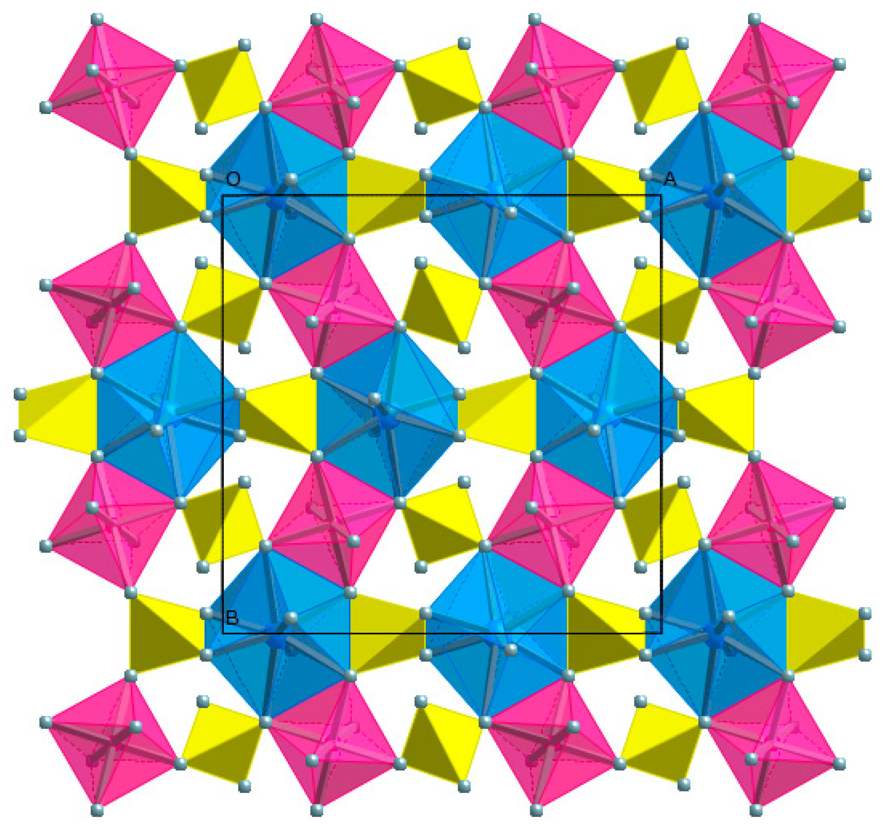
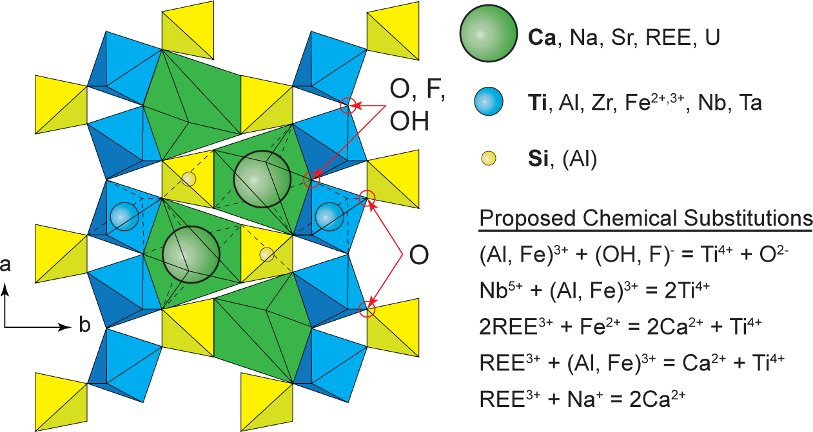

```{r setup, include=FALSE}
knitr::opts_chunk$set(
  echo = F,
  message = F,
  warning = F,
  fig.pos = 'htbp',
  out.extra = '',
  fig.align = 'center',
  out.width = '100%'
)
suppressMessages({
  library(dplyr)
  library(tibble)
  library(readr)
  library(purrr)
  library(stringr)
  library(knitr)
  library(kableExtra)
  library(scales)
})
```

:::::: {.title-and-contact}
::: {.title}

# Diffusion in Crystals

### Estimating geologic cooling rates from diffusion profiles in minerals

### `r format(Sys.time(), "%b %d %Y")`

:::
::: {.info-box}

| Left | Left |
|:------|:-----|
| <i class="fas fa-chalkboard-teacher"></i> | [Dr. Buchanan Kerswell](https://buchanankerswell.com)<br>219 Shideler Hall<br>Drop-in hours:<br>MWF: 9-10am |
| <i class="fas fa-school"></i> | Miami University |
| <i class="fas fa-chalkboard"></i> | GLG 211 Lab, Fall 2022 |
| <i class="fas fa-at"></i> | [kersweb@miamioh.edu](mailto:kersweb@miamioh.edu) |
| <i class='fas fa-globe'></i> | [buchanankerswell.com](https://buchanankerswell.com) |
| <i class='ai ai-google-scholar-square'></i> | [google scholar](https://scholar.google.com/citations?hl=en&user=O7TM22kAAAAJ) |

:::
::::::

::: {.abstract}
:::

# Overview

Write something about how diffusion rates vary for different cations and isotopes, crystal-chemical controls on diffusion rates, the temperature dependence of diffusion, and its application for recovering cooling rates of rock samples. Use @kohn2017a as your guide. For example, Figure \@ref(fig:garnet-structure) & Figure \@ref(fig:titanite-structure). [Fake link](https://scholar.google.com).

Generally speaking, *geospeedometry* involves dozens, or even hundreds, of (sub)micrometer-scale measurements of major elements (e.g. $Fe$, $Mg$), trace elements (e.g. $Zr$, $Ti$), and/or isotopic compositions (e.g. $\delta^{18}O$, $U$-$Th$-$Pb$) across mineral grain boundaries, or from the centers (cores) of a mineral grains to their outer edges (rims). The individual spot measurements of *in situ* crystal chemistry are typically made on an Electron Probe Microanalyzer (EPMA), Laser-Ablation Inductively Coupled Plasma Mass Spectrometer (LA-ICP-MS), or Secondary Ion Mass Spectrometer (SIMS). These instruments have upsides & downsides in terms of their dollar cost, time commitment, accessibility, availability, reliability, capability, and analytical advantages & disadvantages (Table \@ref(tab:instrument-table)).

```{r instrument-table}
tibble(
  'instrument' = c('EPMA', 'LA-ICP-MS', 'SIMS'),
  'precision' = c('1-2', '1-2', '1-2'),
  'size' = c('1-3', '10-50', '1-35'),
  'rate' = c('10-100', '100-600', '1-4'),
  'fee' = c('2-5', '1-2', '25'),
  'prep' = c('C coat', 'none', 'Au coat '),
  'cost' = c('30-50', '30-50', '30-50')
) %>%
kable(
  col.names = c('', 'precision (%)', 'size ($\\mu$)', 'rate (spot/hr)', 'fee (USD/spot)', 'prep', 'cost (USD)'),
  linesep = '',
  caption = 'Common instruments for micro-analyses of minerals',
  escape = F,
  format = 'html'
) %>%
add_header_above(header = c('instrument' = 2, 'spot' = 3, 'sample' = 2)) %>%
footnote(
  general = 'Note: samples can be polished epoxy rounds or thin sections',
  general_title = '',
  threeparttable = T
) %>%
kable_classic()
```

(ref:garnet-structure-cap) The garnet crystal structure showing dodecahedrally- (blue; Mg, Fe$^{2+}$, Mn, Ca), octahedrally- (pink; Al, Fe$^{3+}$), and tetrahedrally-coordinated (yellow; Si) lattice sites. Gray spheres are O atoms. Note the zig-zag arrangement of alternating pink octahedra and blue dodecahedra. From @antao2021.


```{r garnet-structure, fig.cap='(ref:garnet-structure-cap)', out.width='65%'}



```

alsdkfj asdl;fkja;sdfkajsd aosdifjapso dipoasdif aposdfijasd foaisdjfpoas dfoasd fpoaisdjfid jfidfidj fidjfijijfids idfis dif isdjfijsdfij sidjfi dsifj sid fjis dfisjdifisdjf i fijsidj fisjdfijsid fisdjf sidf isdjfijsdi fisjd fi sid jf isdjfisdjifjsi djfijsdfi jsij ijf i sijdfijsidjfisjdf isidjf isjdfijs ifjisjd fisdjfi js alsdkfj asdl;fkja;sdfkajsd aosdifjapso dipoasdif aposdfijasd foaisdjfpoas dfoasd fpoaisdjfid jfidfidj fidjfijijfids idfis dif isdjfijsdfij sidjfi dsifj sid fjis dfisjdifisdjf i fijsidj fisjdfijsid fisdjf sidf isdjfijsdi fisjd fi sid jf isdjfisdjifjsi djfijsdfi jsij ijf i sijdfijsidjfisjdf isidjf isjdfijs ifjisjd fisdjfi js.

alsdkfj asdl;fkja;sdfkajsd aosdifjapso dipoasdif aposdfijasd foaisdjfpoas dfoasd fpoaisdjfid jfidfidj fidjfijijfids idfis dif isdjfijsdfij sidjfi dsifj sid fjis dfisjdifisdjf i fijsidj fisjdfijsid fisdjf sidf isdjfijsdi fisjd fi sid jf isdjfisdjifjsi djfijsdfi jsij ijf i sijdfijsidjfisjdf isidjf isjdfijs ifjisjd fisdjfi js alsdkfj asdl;fkja;sdfkajsd aosdifjapso dipoasdif aposdfijasd foaisdjfpoas dfoasd fpoaisdjfid jfidfidj fidjfijijfids idfis dif isdjfijsdfij sidjfi dsifj sid fjis dfisjdifisdjf i fijsidj fisjdfijsid fisdjf sidf isdjfijsdi fisjd fi sid jf isdjfisdjifjsi djfijsdfi jsij ijf i sijdfijsidjfisjdf isidjf isjdfijs ifjisjd fisdjfi js.

(ref:titanite-structure-cap) Crystal structure of titanite (CaTiSiO$_5$). From @kohn2017c.

```{r titanite-structure, fig.cap='(ref:titanite-structure-cap)'}



```

alsdkfj asdl;fkja;sdfkajsd aosdifjapso dipoasdif aposdfijasd foaisdjfpoas dfoasd fpoaisdjfid jfidfidj fidjfijijfids idfis dif isdjfijsdfij sidjfi dsifj sid fjis dfisjdifisdjf i fijsidj fisjdfijsid fisdjf sidf isdjfijsdi fisjd fi sid jf isdjfisdjifjsi djfijsdfi jsij ijf i sijdfijsidjfisjdf isidjf isjdfijs ifjisjd fisdjfi js alsdkfj asdl;fkja;sdfkajsd aosdifjapso dipoasdif aposdfijasd foaisdjfpoas dfoasd fpoaisdjfid jfidfidj fidjfijijfids idfis dif isdjfijsdfij sidjfi dsifj sid fjis dfisjdifisdjf i fijsidj fisjdfijsid fisdjf sidf isdjfijsdi fisjd fi sid jf isdjfisdjifjsi djfijsdfi jsij ijf i sijdfijsidjfisjdf isidjf isjdfijs ifjisjd fisdjfi js.

# Code block

```
for i in {1..5}
do
  echo "Welcome $i times"
done
```

```
x <- rnorm(400, mean=50, sd=10)
hist(x)
```
```{r}
x <- rnorm(400, mean=50, sd=10)
hist(x)
```

# References {.refs}